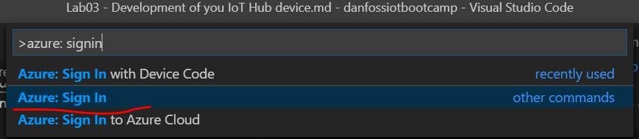

# Purpose
Develop an simulated Azure iot hub device and learn major capabilities of Azure IoT Hub including:
1. Send device to cloud message from device to cloud
2. Invoke device direct method from cloud 
3. Send cloud to device message from cloud to device

# Steps

## Task 0: Prepare your device app code and environment

1. Download the source code from this link: https://github.com/hguomin/danfossiotbootcamp/blob/master/PerfSensorDevice.zip and unzip it to your local folder.

2. Navigate to the root folder of the source code - PerfSensorDevice C# project
   ```bash
    $ cd PerfSensorDevice
   ```

3. Open PerfSensorDevice folder in Visual Studio Code, Replace the value of the iothubDeviceConnectionString variable in Program.cs with the device connection string you made a note of earlier. Then save your changes to Program.cs.
   ```cs
   private static string iothubDeviceConnectionString = "Input your device connection string here.";
   ```
4. In VS Code, press Ctrl+Shift+` to open the TERMINAL window, then run below command to restore the package for this application
   ```
   $ dotnet restore
   ```
5. Connect to your Azure IoT Hub in VS Code 
   
   In VS Code, press F1 to open the Command Palette, type "Azure: Sign In ", select the command and follow the steps to sign in Azure

   

   Once you signed in Azure, in AZURE IOT HUB panel of VS code, click the more action button "..." and select "Select IoT Hub" menu item to select you IoT Hub in VS Code

   

   Choose your subscription:
   

   Choose your IoT Hub:
   

   Now you will connect to your iot hub in VS Code, you can find you device in the device list under the IoT Hub Panel, shown as below:
   

## Task 1: Initialize device client
1. Add below code to the below of the comment line "//TASK-1: create device client from connection string" in MainAsync() method
    ```cs
    deviceClient = DeviceClient.CreateFromConnectionString(iothubDeviceConnectionString);

    ```
## Task 2: Send device telemetry to Azure IoT Hub
1. Add below function code to the below of the comment line "//TASK-2: Send device messgage: SendDeviceTelemetryAsync"
   ```cs
    private static async Task SendDeviceTelemetryAsync()
    {
        while(true)
        {
            //setting sensor data
            var sensorData = new
            {
                CpuUsage = perfCounter.CpuUsage,
                AvailableMemory = perfCounter.MemoryAvailable,
                NetworkLatency = new
                {
                    Host = perfCounter.NetworkHostname,
                    Web = perfCounter.NetworkWebLatency,
                    Ping = perfCounter.NetworkPingLatency
                }
            };

            var msgJson = JsonConvert.SerializeObject(sensorData);
            var message = new Message(Encoding.ASCII.GetBytes(msgJson));

            // Add a custom application property to the message.
            // An IoT hub can filter on these properties without access to the message body.
            message.Properties.Add("cpuLoadAlert", (sensorData.CpuUsage > 80.0) ? "true" : "false");

            // Send the telemetry message
            await deviceClient.SendEventAsync(message);

            Console.WriteLine("\n[DEVICE TELEMETRY]: Sending D2C message: {0} for every {1} ms.", msgJson, telemetryInterval);

            await Task.Delay(telemetryInterval);
        }
    }
   ```
2. Add below code to the below of the comment line "//TASK-2: Send device telemetry " in the MainAsync() function
   ```cs
   tasks.Add(SendDeviceTelemetryAsync());
   ```
3. In VS Code TERMINAL issue below command to run the app
   ```bash
   dotnet run
   ```
4. View the telemetry sent to Azure IoT Hub
   In the "AZURE IOT HUB" Panel in VS Code, select your device and right click, select "Start Monitoring Built-in Event Endpoint", as below shown
   

   then you will see all telemetry message the device sent to Azure IoT Hub in the output window in VS Code
   

## Task 3: Handle device command for setting telemetry interval 
1. Add below function code to the below of the comment line "//TASK-3: Handle device command: SetTelemetryInterval"
   ```cs
   private static Task<MethodResponse> SetTelemetryInterval(MethodRequest methodRequest, object context)
   {
       var data = Encoding.UTF8.GetString(methodRequest.Data);
       int dataVal = 0;
       if(Int32.TryParse(data, out dataVal))
       {
           Console.ForegroundColor = ConsoleColor.Red;
           Console.WriteLine("\n[DEVICE METHORD]: Telemetry interval set to {0} ms", dataVal);
           Console.ResetColor();

           lock(telemetryIntervalLock)
           {
               telemetryInterval = dataVal;
           }
           // Acknowlege the direct method call with a 200 success message
           string result = "{\"result\":\"Executed direct method: " + methodRequest.Name + "\"}";
           return Task.FromResult(new MethodResponse(Encoding.UTF8.GetBytes(result), 200));
       }
       else
       {
           // Acknowlege the direct method call with a 400 error message
           string result = "{\"result\":\"Invalid parameter\"}";
           return Task.FromResult(new MethodResponse(Encoding.UTF8.GetBytes(result), 400));
       }
   }
   ```
2. Add below code to the below of the comment line "//TASK-3: register device method for command" in the MainAsync() function to register this device method
   ```cs
   deviceClient.SetMethodHandlerAsync(nameof(SetTelemetryInterval), SetTelemetryInterval, null).Wait();
   ```
3. In VS Code TERMINAL issue below command to run the app
   ```bash
   dotnet run
   ```
4. Invoke the device command remotely in VS Code
   In the "AZURE IOT HUB" Panel in VS Code, select your device and right click, select "Invoke Device Direct Method", as below shown:
   

   Input the command name "SetTelemetryInterval" and press Enter:
   

   Input a number like 2000 and then press Enter to start invoke the device command remotely
   

   Once the command executed by the device, it will return the response result and you will see it in VS Code OUTPUT window:
   

   Then you can see the interval of telemetry sent are changed in the device app:
   
   
## Task 4: Handle device command for changging network latency test target
1. Add below function code to the below of the comment line "//TASK-4: Handle device command: SetNetworkLatencyTestTargetHost"
   ```cs
    private static Task<MethodResponse> SetNetworkLatencyTestTargetHost(MethodRequest methodRequest, object context)
    {
       string host = Encoding.UTF8.GetString(methodRequest.Data);
       if(!string.IsNullOrEmpty(host))
       {
           host = host.Trim('"');
           Console.ForegroundColor = ConsoleColor.Yellow;
           Console.WriteLine("\n[DEVICE METHORD]: Network latency test target host set to {0}.", host);
           Console.ResetColor();

           perfCounter.NetworkHostname = host;

           // Acknowlege the direct method call with a 200 success message
           string result = "{\"result\":\"Executed direct method: " + methodRequest.Name + "\"}";
           return Task.FromResult(new MethodResponse(Encoding.UTF8.GetBytes(result), 200));
       }
       else
       {
           // Acknowlege the direct method call with a 400 error message
           string result = "{\"result\":\"Invalid parameter\"}";
           return Task.FromResult(new MethodResponse(Encoding.UTF8.GetBytes(result), 400));
       }
    }
   ```
2. Add below code to the below of the comment line "//TASK-4: register device method for SetNetworkLatencyTestTargetHost" in the MainAsync() function to register this device method
   ```cs
   deviceClient.SetMethodHandlerAsync(nameof(SetNetworkLatencyTestTargetHost), SetNetworkLatencyTestTargetHost, null).Wait();
   ```
3. In VS Code TERMINAL issue below command to run the app
   ```bash
   dotnet run
   ```
4. Invoke the device command remotely in VS Code
   In the "AZURE IOT HUB" Panel in VS Code, select your device and right click, select "Invoke Device Direct Method", input the command name "SetNetworkLatencyTestTargetHost" and press Enter:
   

   Input new host url like "www.microsoft.com" and then press Enter to start invoke the device command remotely
   

   Once the command executed by the device, it will return the response result and you will see it in VS Code OUTPUT window:
   

   Then you can see the network latency test target host are changed in the device app:
   

## Task 5: Receive cloud to device message
1. Add below function code to the below of the comment line "//TASK-5: Receive cloud to device message: ReceiveDeviceMessage"
   ```cs
   private static async Task ReceiveDeviceMessage()
   {
       Console.WriteLine("\n[DEVICE MESSAGE]> Device waiting for commands from IoTHub...");

       Message receivedMessage;
       string messageData;

       while (true)
       {
           receivedMessage = await deviceClient.ReceiveAsync(TimeSpan.FromSeconds(30)).ConfigureAwait(false);

           if (receivedMessage != null)
           {
               messageData = Encoding.ASCII.GetString(receivedMessage.GetBytes());

               Console.ForegroundColor = ConsoleColor.Green;
               Console.WriteLine("\n[DEVICE MESSAGE]> {0}: Received message: {1}", DateTime.Now.ToLocalTime(), messageData);
               Console.ResetColor();

               int propCount = 0;
               foreach (var prop in receivedMessage.Properties)
               {
                   Console.ForegroundColor = ConsoleColor.Green;
                   Console.WriteLine("\n[DEVICE MESSAGE]> Property[{0}> Key={1} : Value={2}", propCount++, prop.Key, prop.Value);
                   Console.ResetColor();
               }

               await deviceClient.CompleteAsync(receivedMessage).ConfigureAwait(false);
           }
           else
           {
               Console.WriteLine("\n[DEVICE MESSAGE]> {0}: Timed out", DateTime.Now.ToLocalTime());
           }
       }
    }
   ```
2. Add below code to the below of the comment line "//TASK-5: receive cloud to device message" in the MainAsync() function to add the receive device message task
   ```cs
   tasks.Add(ReceiveDeviceMessage());
   ```
3. In VS Code TERMINAL issue below command to run the app
   ```bash
   dotnet run
   ```
4. Send remote message from cloud to device
   In the "AZURE IOT HUB" Panel in VS Code, select your device and right click, select "Invoke Device Direct Method", as below shown:
   

   Then input any message you want to send to the device from Azure IoT Hub, like "hello device!" and press Enter
   

   Your device app will receive the message you just sent from the cloud:
   

